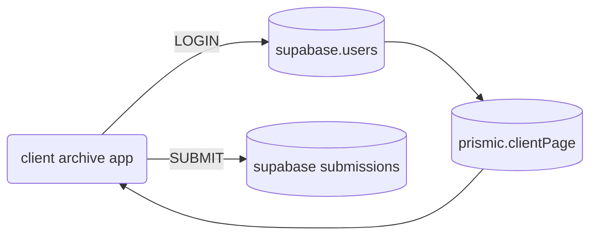

---
{"dg-publish":true,"permalink":"/client-design-archive/index/"}
---

[[client-design-archive/step 1 - creating a prismic page for design archive data\|step 1 - creating a prismic page for design archive data]]
[[client-design-archive/step 2 - creating a client login\|step 2 - creating a client login]]
[[client-design-archive/step 3 - accessing submitted design lists\|step 3 - accessing submitted design lists]]

## Overview

  

1. Client visits App at 'clients.andersonsupply.com'
2. Client logs in with their provided email and password credentials
3. App checks the Supabase Users database to validate their sign in info, and picks up their Prismic Page Slug
4. App sends the Prismic Page Slug to Prismic to fetch the Client Archive Page associated with it
5. App loads the Client Archive Page using the data fetched from Prismic
6. Client makes selections of their designs in the app
7. Client proceeds to input their info and notes
8. Client submits their selection and info
9. App posts the submission to a table in Supabase

